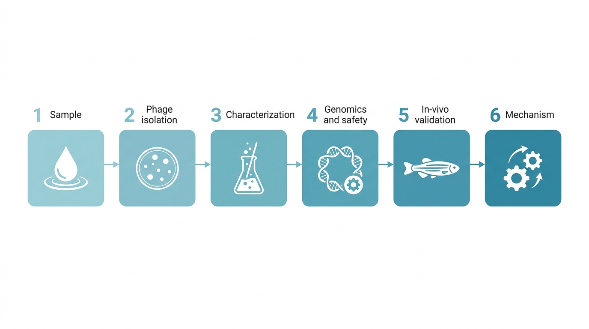
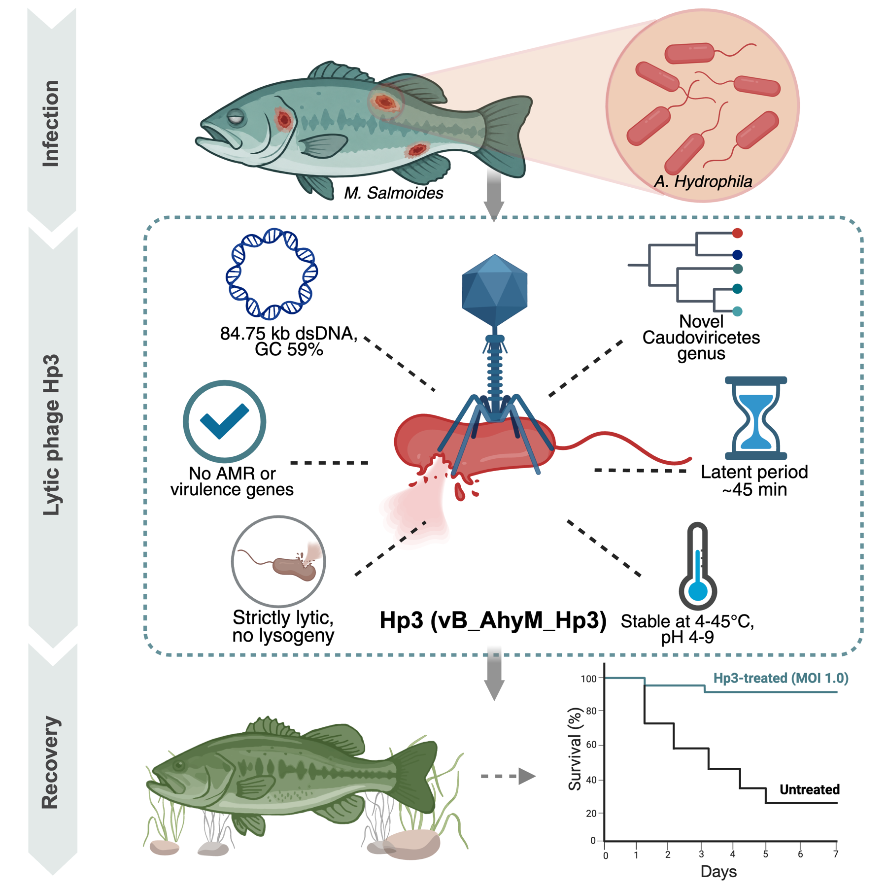
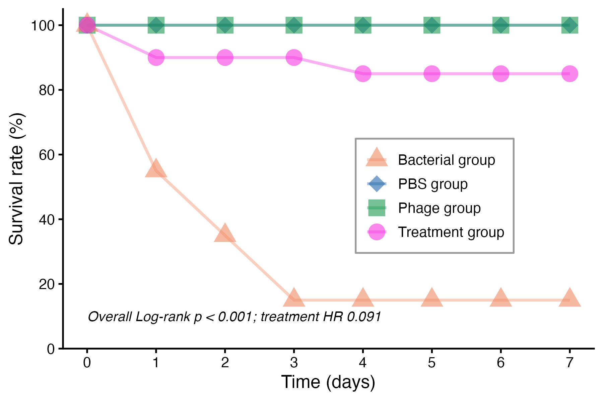
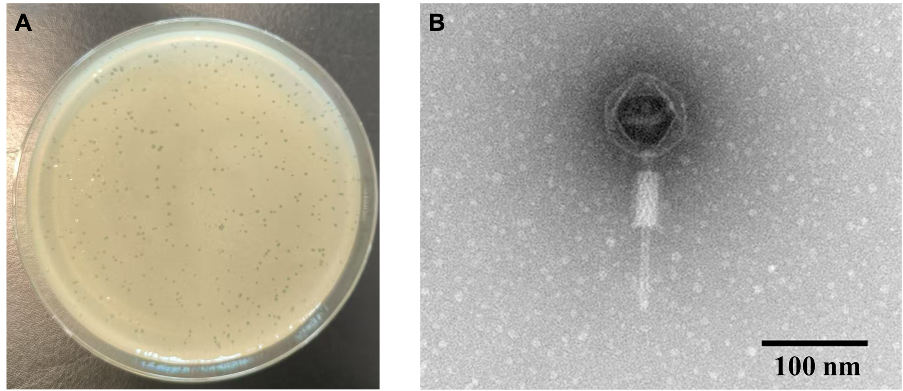
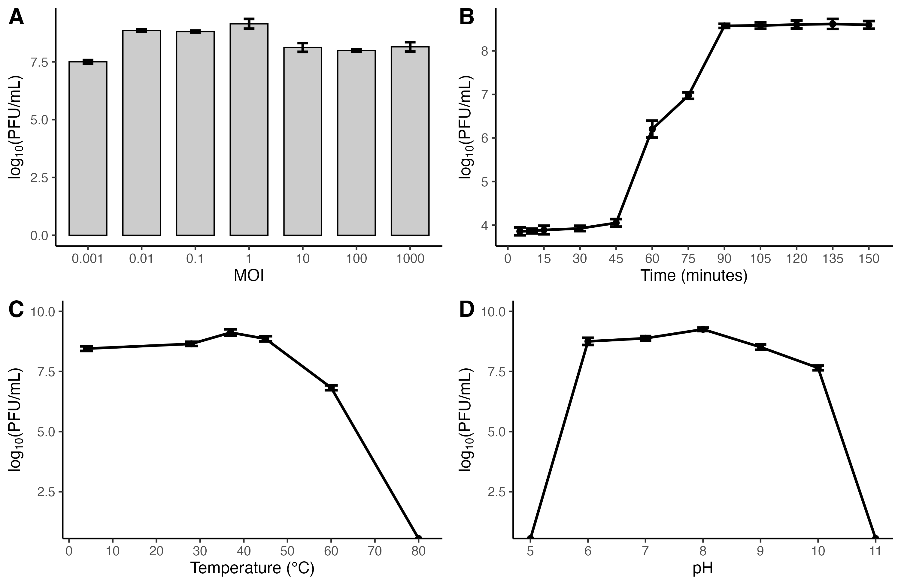
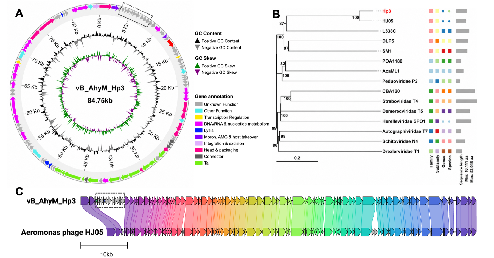
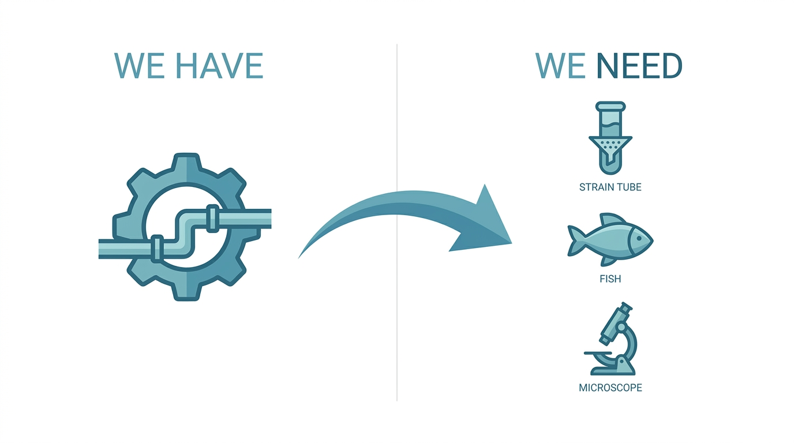
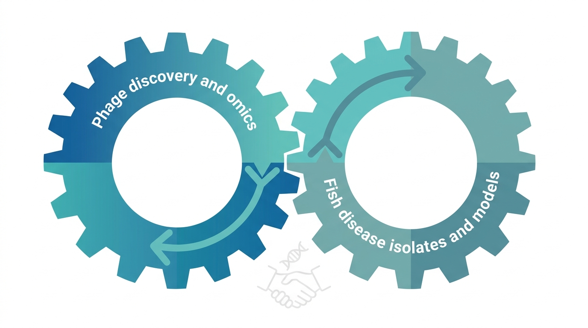
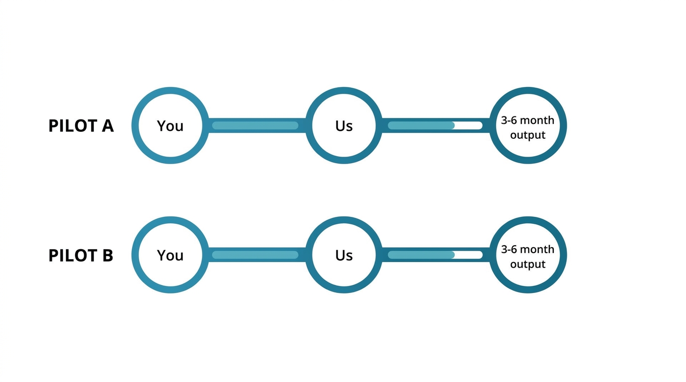

## Who I am · An integrated phage pipeline {.smaller}

:::: {.columns}
::: {.column width="55%"}
**I combine wet-lab phage work with bioinformatics** — I can run the full loop myself:

- **Discovery & characterization** — isolation, host range, lytic kinetics, stability
- **Genomics & safety** — assembly, annotation, taxonomy, ARG / virulence screen
- **Host–phage interaction** — *in vivo* efficacy, immunophage synergy, phage–antibiotic interaction

*Broader background: virome across host systems · AI-for-science methods*
:::
::: {.column width="45%"}

:::
::::

::: {.notes}
My niche is that I don't just discover phages — I close the loop. The same person can isolate a phage, characterize it, sequence and annotate the genome, screen it for safety, and run the in-vivo efficacy study. That makes the discovery-to-validation cycle fast. Today I'll show one case where we did exactly that, on an aquaculture pathogen.
:::

## We already do this — on an aquaculture pathogen {.smaller}

:::: {.columns}
::: {.column width="48%"}

:::
::: {.column width="52%"}
Novel phage **vB_AhyM_Hp3** vs *Aeromonas hydrophila* in **largemouth bass**

- Lethal-challenge survival: [**15% → 85%**]{.bigstat}
- Log-rank *p* < 0.001 · HR = 0.091
- Histology: liver / spleen damage largely prevented
- Genome: **no ARGs, no functional virulence genes, strictly lytic**

{width="78%"}
:::
::::

::: {.notes}
This is the punchline of why I think we're a good fit. We isolated a novel phage against Aeromonas hydrophila — one of the exact pathogens you mentioned — from a diseased largemouth bass. A single phage dose, one hour after a lethal bacterial challenge, took survival from 15% up to 85%, with the histology showing the liver and spleen were largely protected. And the genome is clean — no resistance or virulence genes, strictly lytic. So the capability isn't theoretical; it's already validated on an aquaculture-relevant system.
:::

## The same toolbox transfers to new systems {.smaller}

:::: {.columns}
::: {.column width="33%"}

**Morphology & identity** TEM · plaque assay
:::
::: {.column width="33%"}

**Function & stability** ~90 min lytic cycle · stable 4–45 °C, pH 6–9 *(aquaculture-relevant)*
:::
::: {.column width="33%"}

**Genomics · taxonomy · safety** putative **new genus** · ARG / virulence screen
:::
::::

::: {.lead}
Plug in a new pathogen → we run the same pipeline.
:::

::: {.notes}
What makes this reusable is that every step is a standard module. Morphology and host range, then functional kinetics and stability — note the phage is stable across the temperature and pH range you'd actually see in aquaculture water. Then full genomics: this one turned out to be a putative new viral genus, and we screen every genome for resistance and virulence genes before anything goes near an animal. Give us a new pathogen — say a Vibrio — and we just plug it into the same pipeline.
:::

## Where we need the aquaculture side {.smaller}

:::: {.columns}
::: {.column width="55%"}
**What we have:** the pipeline, the bioinformatics, phage-isolation know-how

**What we're missing:**

- 🧫 **Material** — well-characterized aquaculture pathogen **isolates** (esp. *Vibrio* spp. — *V. parahaemolyticus*, *V. harveyi* — and more *A. hydrophila*)
- 🐟 **Context** — which pathogens / diseases are **most urgent** in Bavarian / German / EU aquaculture
- 🔬 **Validation** — an **infection-relevant testing interface** (ex-vivo, challenge, or disease-associated)

*Exactly what a fish-disease group is best positioned to provide.*
:::
::: {.column width="45%"}

:::
::::

::: {.notes}
Here's where we genuinely need a partner. We can run the pipeline, but we're not the ones who know which pathogens actually matter in German aquaculture, and we don't have access to a panel of well-characterized fish-pathogen isolates — especially the Vibrio species. We also need a realistic, infection-relevant way to validate, which is exactly your domain. So these gaps aren't weaknesses to hide — they're the natural interface to your group.
:::

## Your side closes exactly our three gaps {.smaller}

:::: {.columns}
::: {.column width="52%"}
- Material gap → **characterized isolates & collections / contacts**
- Context gap → **disease prioritization & farming-scenario relevance**
- Validation gap → **infection-relevant / ex-vivo / disease models**

**Network:** where a strain isn't in-house, help **connecting** to diagnostic labs / farms / research networks

::: {.lead}
Complementary, not overlapping — discovery + omics (us) × disease + isolates + models (you).
:::
:::
::: {.column width="48%"}

:::
::::

::: {.notes}
This is why I think the fit is clean rather than overlapping. You have the disease expertise, the isolates or the contacts to get them, and an infection model. We have the discovery engine, the omics, and the mechanism work. Even where you don't hold a strain yourself, your network into diagnostic labs and farms is something we simply can't replicate. Together it's a complete loop.
:::

## Two pilots — small, fast, clearly defined {.smaller}

:::: {.columns}
::: {.column width="55%"}
**Pilot A — Bavarian isolate panel + first phage hunt**

- *You:* provide / connect 1–2 priority *Vibrio* / *Aeromonas* isolates
- *Us:* phage isolation + host-range mapping + genome / safety screen
- *3–6 mo:* a characterized phage panel vs a priority pathogen

**Pilot B — Phage–antibiotic combination**

- Builds on our *A. baumannii* phage–antibiotic interaction experience
- Mechanism + applied value in one pilot

*(Stretch)* plug a lead phage into your infection-relevant model — *no complex animal commitment up front*
:::
::: {.column width="45%"}

:::
::::

::: {.notes}
So concretely, two pilots. Pilot A is the most direct fit to your original email: you point us at one or two priority isolates — Vibrio or Aeromonas — and we run phage isolation, host-range mapping, and a fast genome and safety screen. In three to six months you'd have a characterized phage panel against a pathogen that actually matters. Pilot B leans on something we've already done — phage–antibiotic combinations, in our case on A. baumannii — which transfers naturally and gives both mechanism and applied value. We don't need to commit to complex animal work on day one.
:::

## What I'd love to decide today

1. Which **pathogen** should we prioritize first?
2. What **isolates or collections** are accessible on your side?
3. What **validation model** is feasible for you?
4. What would be a realistic **3–6 month pilot outcome**?

 

::: {.lead}
Let's co-design one small project we can start in the coming months.
:::

::: {.notes}
I'll stop here so we have time to actually talk. These are the four things I'd love to get a first read on today — which pathogen, what isolates you can reach, what validation is feasible on your end, and what a realistic three-to-six-month outcome would be. From there we can shape one small project.
:::
